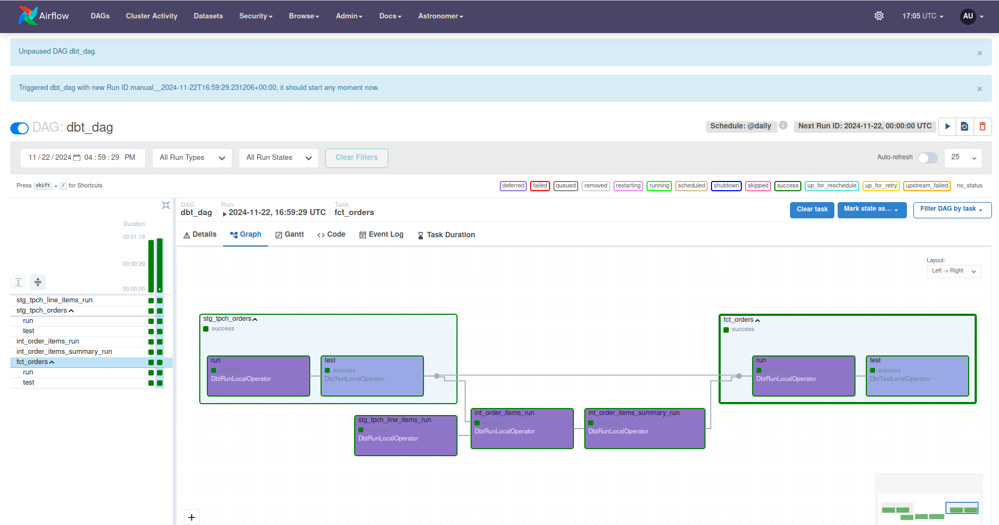

# ELT Pipeline Automation with dbt, Snowflake, and Airflow

## Overview

The goal of this project is to create a modern, efficient, and reusable ELT pipeline that extracts raw data, applies transformations, and loads the results into Snowflake for analytics and business intelligence purposes. By leveraging **dbt** for transformations and **Airflow** for orchestration, this pipeline ensures scalability, modularity, and maintainability.

---

## Features

- **Source Configuration**: Integration with Snowflake’s sample data (TPCH schema).
- **dbt Transformations**: Creation of staging and mart models with reusable macros for maintainability.
- **Airflow Orchestration**: Scheduling and monitoring pipeline execution.
- **Data Quality Assurance**: Implementation of generic and singular tests to ensure data reliability.
- **Automation**: End-to-end pipeline that runs on a daily schedule in Airflow.

---

## Architecture

### **Tools and Technologies**  

- **Snowflake**: Cloud-based data warehouse for storing and querying data.  
- **dbt (Data Build Tool)**: For data transformations and modeling.  
- **Airflow**: Workflow orchestration for scheduling and monitoring pipelines.  
- **Astronomer Cosmos**: Integration library for dbt and Airflow.  

### **Pipeline Workflow**  

1. **Data Source**: Extract data from `snowflake_sample_data.tpch_sf1` tables (`orders` and `lineitem`).  
2. **Staging Models**: Clean and prepare data in Snowflake using dbt staging models.  
3. **Transformations**: Create intermediate tables, data marts, and fact tables for analytics.  
4. **Testing**: Validate data using dbt's generic and custom tests.  
5. **Orchestration**: Automate the pipeline using Airflow and monitor its execution.

---


## **Directory Structure**  

```plaintext
.
dags/
├── dbt/
│   ├── ETL_Pipeline/
│   │   ├── analyses/
│   │   ├── dbt_packages/
│   │   ├── logs/
│   │   ├── macros/
│   │   ├── models/
│   │   ├── seeds/
│   │   ├── snapshots/
│   │   ├── target/
│   │   ├── tests/
│   │   ├── .gitignore
│   │   ├── dbt_project.yml
│   │   ├── package-lock.json
│   │   ├── packages.yml
│   │   └── README.md
├──dbt_dag.py
Dockerfile


```

---

## **Setup and Installation**  

### **1. Snowflake Environment Setup**  

Use the SQL script below to configure the Snowflake warehouse, database, role, and schema:

```sql
use role accountadmin;

create warehouse dbt_wh with warehouse_size='x-small';
create database if not exists dbt_db;
create role if not exists dbt_role;

grant role dbt_role to user <your_user>;
grant usage on warehouse dbt_wh to role dbt_role;
grant all on database dbt_db to role dbt_role;

use role dbt_role;

create schema if not exists dbt_db.dbt_schema;
```

---

### **2. Configure dbt**  

Set up your `dbt_profile.yaml` to point to your Snowflake environment:

```yaml
models:
  snowflake_workshop:
    staging:
      materialized: view
      snowflake_warehouse: dbt_wh
    marts:
      materialized: table
      snowflake_warehouse: dbt_wh
```

---

### **3. Data Models**  

#### **Source Configuration (YAML)**  
Define source tables and add tests for `orders` and `lineitem`:

```yaml
version: 2
sources:
  - name: tpch
    database: snowflake_sample_data
    schema: tpch_sf1
    tables:
      - name: orders
        columns:
          - name: o_orderkey
            tests:
              - unique
              - not_null
```

#### **Staging Models**  

Transform source data into clean staging tables:

```sql
-- stg_tpch_orders.sql
select
    o_orderkey as order_key,
    o_custkey as customer_key,
    o_orderstatus as status_code,
    o_totalprice as total_price,
    o_orderdate as order_date
from
    {{ source('tpch', 'orders') }}
```

---

### **4. Transformations**  

#### **Intermediate Models**  
Create intermediate models for better organization:  

```sql
-- int_order_items.sql
select
    line_item.order_item_key,
    line_item.extended_price,
    orders.order_key,
    orders.customer_key
from
    {{ ref('stg_tpch_orders') }} as orders
join
    {{ ref('stg_tpch_line_items') }} as line_item
        on orders.order_key = line_item.order_key
```

#### **Data Marts**  

Aggregate data to build analytics-ready tables:  

```sql
-- fct_orders.sql
select
    orders.*,
    order_item_summary.gross_item_sales_amount
from
    {{ ref('int_order_items_summary') }} as order_item_summary
join
    {{ ref('stg_tpch_orders') }} as orders
    on orders.order_key = order_item_summary.order_key
```

---

### **5. Orchestration with Airflow**  

#### **Dockerfile Update**  
Add dbt installation to the Airflow Docker image:  

```dockerfile
RUN python -m venv dbt_venv && source dbt_venv/bin/activate && \
    pip install --no-cache-dir dbt-snowflake && deactivate
```

#### **Add Airflow DAG**  

```python
from cosmos import DbtDag

dbt_dag = DbtDag(
    project_config=ProjectConfig("/usr/local/airflow/dags/dbt/ELT_Pipeline"),
    schedule_interval="@daily",
    start_date=datetime(2023, 9, 10),
    catchup=False,
    dag_id="dbt_dag",
)
```
### Initialize Astronomer Dev Environment
Astronomer Cosmos makes it easy to integrate dbt with Airflow. Follow these steps to set up and launch the project:

1. **Install Astronomer CLI**  
   Follow [this guide](https://www.astronomer.io/docs/astro/cli/install-cli) to install the Astronomer CLI.

2. **Initialize the Dev Environment**  
   Run the following command to initialize the Astronomer development environment:
   ```bash
   astro dev init
   ```

3. **Start the Astronomer Development Environment**  
   Launch the environment:
   ```bash
   astro dev start
   ```

4. **Access the Airflow UI**  
   Once the environment starts, the Airflow UI will be available at `http://localhost:8080`.

### **2. Configure Snowflake Connection**
1. Add your Snowflake connection details to the Airflow UI:
   ```json
   {
     "account": "<account_locator>-<account_name>",
     "warehouse": "dbt_wh",
     "database": "dbt_db",
     "role": "dbt_role",
     "insecure_mode": false
   }
   ```

2. Define your `dbt_profile.yml` to connect dbt with Snowflake.

---

### Resources and Documentation

#### **1. Astronomer Cosmos Installation**
Astronomer Cosmos is a powerful framework that simplifies the integration of dbt projects with Apache Airflow, enabling seamless orchestration of ELT pipelines. The first step to utilizing this framework is to install the Astronomer CLI, which facilitates the management and deployment of Airflow DAGs.

To install Astronomer Cosmos, follow these steps:

- Refer to the [official Astronomer CLI Installation Guide](https://www.astronomer.io/docs/astro/cli/install-cli/?tab=linux) to set up the CLI on your system.
- After installation, you can leverage the CLI to orchestrate and monitor your dbt pipelines efficiently within Airflow. The CLI enables streamlined workflows and enhances productivity for managing data pipelines.

#### **2. Astronomer Cosmos Documentation**
The Astronomer Cosmos framework provides comprehensive documentation to guide users through every aspect of integrating dbt with Airflow. This documentation offers insights into:

- **Configuring Airflow to Work with dbt**: Step-by-step instructions for setting up connections and creating Airflow-compatible DAGs using Astronomer Cosmos.
- **Project Structure**: Guidelines for organizing your dbt and Airflow projects, ensuring a scalable and maintainable architecture.
- **Execution and Orchestration**: Best practices for orchestrating dbt tasks as Airflow operators, along with details on scheduling and monitoring your pipelines.
- **Custom Configurations**: Tips on customizing profiles, DAG settings, and execution environments for specific project needs.

For detailed documentation, refer to the [Astronomer Cosmos Official Documentation](https://astronomer.github.io/astronomer-cosmos/getting_started/astro.html). This resource provides in-depth explanations and examples to help you harness the full potential of Cosmos for managing your ELT pipelines.

By following these resources, you can effectively integrate dbt with Airflow and streamline your data pipeline workflows with Astronomer Cosmos.

## Pipeline Success
## **Capture: Successful Pipeline Execution**

Once the pipeline runs successfully in Airflow, you can capture the result by taking a screenshot of the **Airflow DAG** in the "Success" state. Follow these steps:

1. Open the Airflow UI (`http://localhost:8080`).
2. Navigate to your DAG (`dbt_dag`).
3. Trigger the DAG and wait for it to complete.


Below is a screenshot of the successful execution of the pipeline in Airflow:


